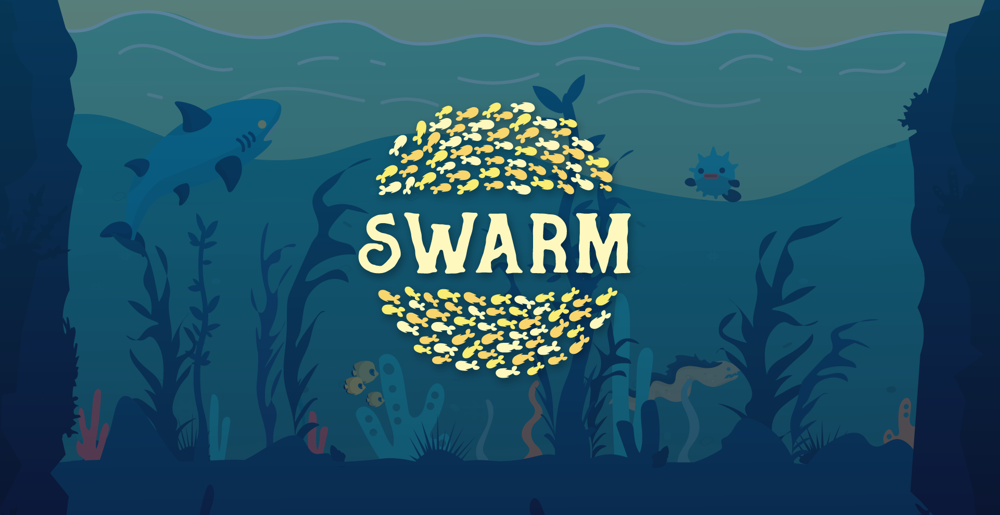
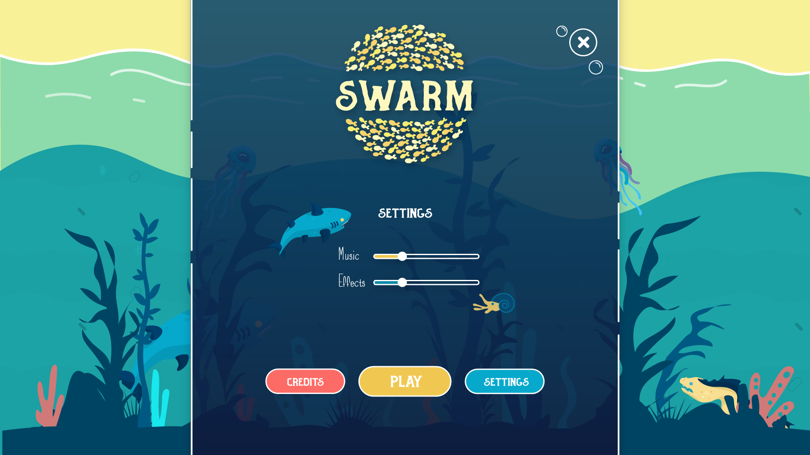
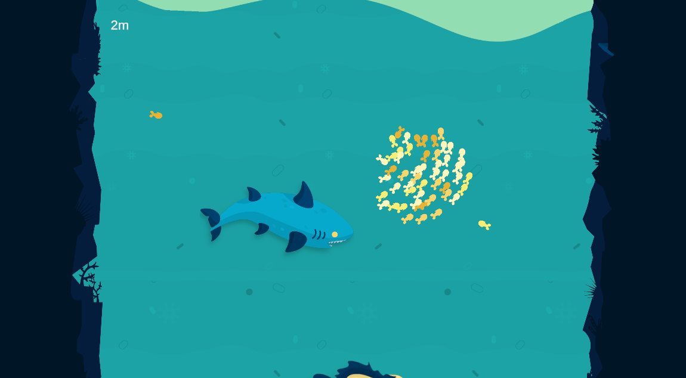
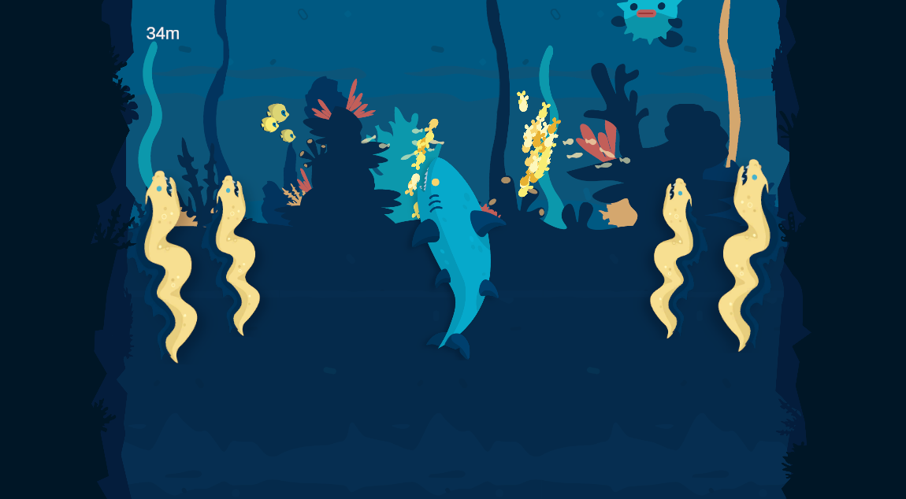
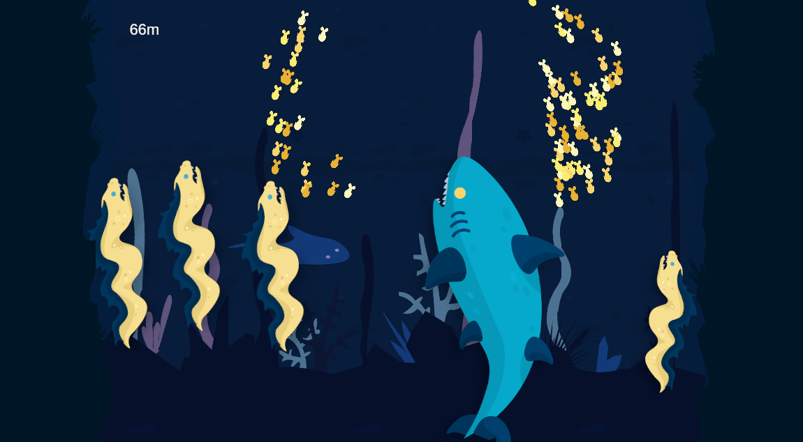

# Swarm

Swarm is a game where you are strong together, but also when you're apart. Try to dodge the enemies and get to the bottom.

Made during the [7th Klagenfurt GameJam](https://www.itec.aau.at/gamejam/) in cooperation with [Peter Hafele](http://peterhafele.com/).

### [Play on itch.io](https://noermel.itch.io/swarm)

### [Download Executable](./Releases)

 
 
 

---

